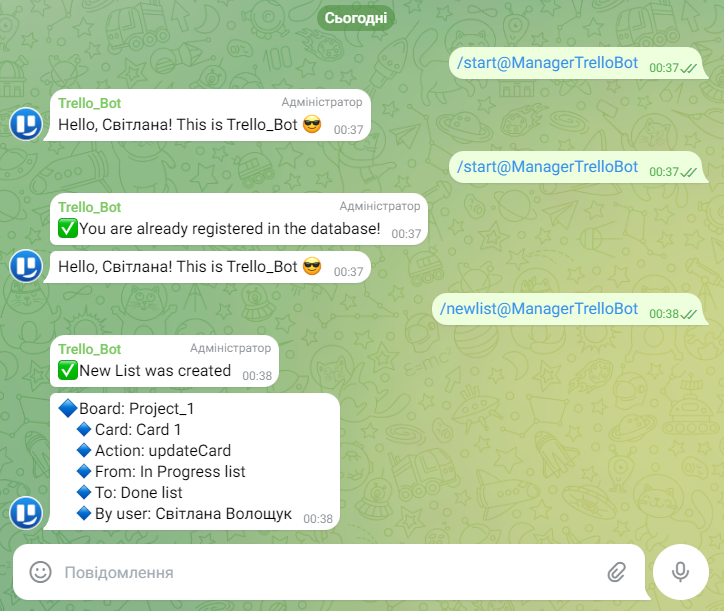

# 🤖 Telegram-Trello-Bot

This Bot has connection with Trello Board of this Group and have three ables:

- say Hello and register new user in database on command /start
- create New List in Trello Board of the Group project on command /newList
- send the message about changes cards in Board Trello

## 🎨 Preview

## 🚀Features

1. Registered the Telegram-bot.
2. Set up a web server that receives requests from the Telegram bot via webhook and sends responses to the user through the bot.
3. Set up a database (Firebase-realtime-database) where the bot saves the data (id, first name, last name) of a new user.
4. Created a group Telegram chat with the bot. Commands for the bot are available in the group chat.
5. Manually created the "InProgress" and "Done" columns in Trello. The link provides access to editing the columns.
6. Implemented the API to receive a webhook from Trello. Trello transmits information about the movement of cards between columns to the server via a webhook, and the server transmits information about card changes via a telegram bot in the form of a message to the group chat.
7. The Telegram bot can process two commands:

- /start - greets the user by his name and records a new user in the database; the bot checks if the user's data is already saved in the database, the bot sends a message that the user has already been registered.
- /newlist - creates a new column in the Trello board named "New List" and sends a notification to the user that the column has been created;
